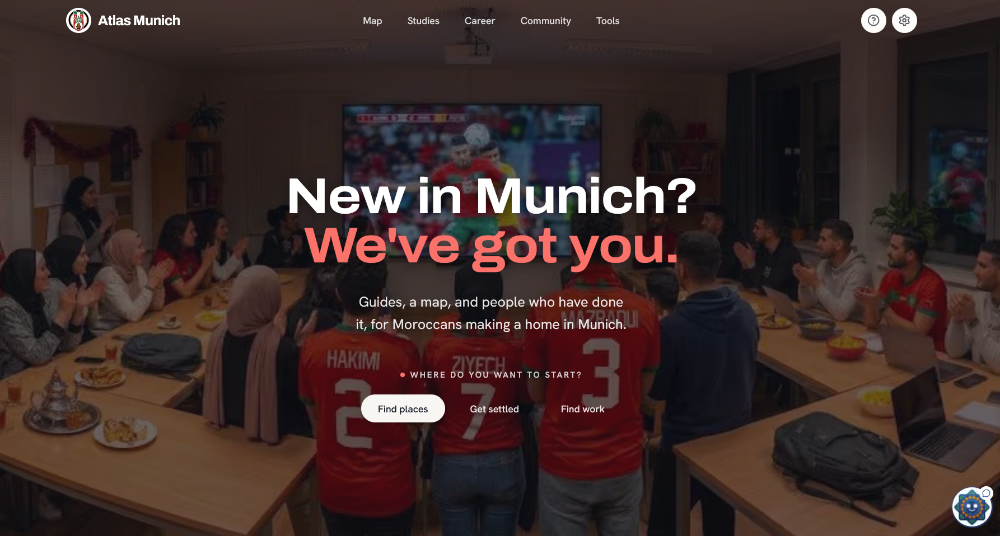

<div align="center">

<h1>
  
  <span style="vertical-align: middle;">Atlas Munich</span>
</h1>

**Your Complete Guide to Thriving in Munich**



Built by Hamza Chaouki, for the Moroccan community. Everything you need to navigate life in Munich — from your first Anmeldung to finding the best tajine in town.

[](https://nextjs.org)
[](https://www.typescriptlang.org/)
[](LICENSE)

[🌐 Live Demo](https://atlasmunich.de) · [📖 Documentation](#features) · [🐛 Report Bug](../../issues) · [✨ Request Feature](../../issues)

</div>

---

## 📋 Table of Contents

- [About](#about)
- [Features](#features)
- [Tech Stack](#tech-stack)
- [Getting Started](#getting-started)
- [Database & Job Board](#database--job-board)
- [Project Structure](#project-structure)
- [Internationalization](#internationalization)
- [Contributing](#contributing)
- [License](#license)

## 🌍 About

Atlas Munich is a comprehensive web platform designed to help members of the Moroccan community navigate life in Munich, Germany. Whether you're a newcomer or a long-time resident, this guide provides essential information about:

- 🏠 **Housing & Registration** - Finding accommodation and completing bureaucratic procedures
- 🍽️ **Food & Dining** - Discovering halal restaurants and Moroccan cuisine
- 📚 **Practical Guides** - Step-by-step tutorials for common tasks
- 🗺️ **Places & Services** - Community-recommended locations
- ❓ **FAQs** - Answers to frequently asked questions
- 💬 **AI Chat Guides** - Persona-driven assistants for housing, bureaucracy, academics, and healthcare
- 💼 **Curated Job Board** - Admin-published Werkstudent, internship, and early-career opportunities

## ✨ Features

- **🌐 Multilingual Support** - Available in English, French, and German
- **🔍 Smart Search** - Fuzzy search powered by Fuse.js to find guides quickly
- **🗺️ Interactive Maps** - Explore places with Leaflet.js integration
- **📱 Responsive Design** - Beautiful, modern UI that works on all devices
- **🌓 Dark Mode** - Eye-friendly theme switching with next-themes
- **♿ Accessible** - Built with accessibility in mind using Radix UI components
- **⚡ Lightning Fast** - Optimized with Next.js 16 and Turbopack
- **🎨 Modern UI** - Styled with Tailwind CSS and shadcn/ui components
- **🧹 Clean Code** - Automated linting, formatting, and pre-commit hooks

## 🛠️ Tech Stack

- **Framework:** [Next.js 16](https://nextjs.org/) with App Router
- **Language:** [TypeScript](https://www.typescriptlang.org/)
- **Styling:** [Tailwind CSS 4](https://tailwindcss.com/)
- **UI Components:** [Radix UI](https://www.radix-ui.com/) + [shadcn/ui](https://ui.shadcn.com/)
- **Internationalization:** [next-intl](https://next-intl-docs.vercel.app/)
- **Maps:** [Leaflet](https://leafletjs.com/) + [React Leaflet](https://react-leaflet.js.org/)
- **Search:** [Fuse.js](https://fusejs.io/)
- **Content:** [react-markdown](https://github.com/remarkjs/react-markdown)
- **Icons:** [Lucide React](https://lucide.dev/)
- **Database:** [Neon Postgres](https://neon.com/) with [Drizzle ORM](https://orm.drizzle.team/)
- **Code Quality:** ESLint, Prettier, Husky, lint-staged

## 🚀 Getting Started

### Prerequisites

- **Node.js 20+** and npm/yarn/pnpm
- **Git** for version control

### Quick Start

1. **Clone the repository**

```bash
git clone https://github.com/HamzaChx/Atlas-Munich.git
cd Atlas-Munich
```

2. **Install dependencies**

```bash
npm install
```

3. **Run the development server**

```bash
npm run dev
```

4. **Open your browser**

Navigate to [http://localhost:3000](http://localhost:3000) to see the application.

### Available Scripts

```bash
npm run dev           # Start development server with Turbopack
npm run build         # Build for production
npm run start         # Start production server
npm run lint          # Check for linting errors
npm run lint:fix      # Auto-fix linting errors
npm run format        # Format code with Prettier
npm run format:check  # Check code formatting
npm run db:generate   # Generate a migration after changing src/db/schema.ts
npm run db:migrate    # Apply pending migrations to DIRECT_DATABASE_URL
```

## 🗄️ Database & Job Board

Atlas Munich uses Neon Postgres as the persistent store for places, anonymous device profiles,
push subscriptions, and curated jobs. It uses two server-only connection strings:

- `DIRECT_DATABASE_URL` is the owner connection for local migrations and manual administration.
- `DATABASE_URL` is the restricted `atlas_app` runtime connection for Vercel. Never prefix either
  variable with `NEXT_PUBLIC_`, and never add `DIRECT_DATABASE_URL` to Vercel.

### Connect Neon and Vercel

1. Create a Neon project in a region close to the Vercel deployment and copy its pooled connection string.
2. Add the owner string locally as `DIRECT_DATABASE_URL`; it is used only for `npm run db:migrate`
   and trusted administration.
3. Run `npm run db:migrate`. This creates the restricted `atlas_app` Postgres role and enables
   forced row-level security on every Atlas table.
4. In the Neon SQL Editor, still connected as the owner, assign the app role a unique password:

   ```sql
   ALTER ROLE atlas_app WITH LOGIN PASSWORD 'a-unique-long-secret-from-your-password-manager';
   ```

5. In Neon’s **Connect** dialog, select `atlas_app` and copy its connection string. Add that string
   as `DATABASE_URL` in Vercel for Preview and Production, then deploy.

The application rejects a `DATABASE_URL` whose role is not `atlas_app`, preventing an owner or
`BYPASSRLS` credential from being deployed accidentally.

### Database Security

The RLS migration takes a default-deny approach: places, device profiles, and push subscriptions
have no runtime policies or grants, so the Vercel role cannot read or write them. The only exception
is a read-only policy for jobs that exposes rows only when they are published, already live, and not
expired. No public job write route or API exists.

Do not create `atlas_app` in the Neon Console: console-created roles inherit Neon's
`neon_superuser` membership, which can bypass RLS. The migration creates the role through SQL with
`NOBYPASSRLS` instead. Do not enable Neon’s Data API or any browser-to-database connection while
this app uses server-side access only.

Verify the deployment role and policies in the Neon SQL Editor:

```sql
SELECT rolname, rolbypassrls
FROM pg_roles
WHERE rolname = 'atlas_app';

SELECT relname, relrowsecurity, relforcerowsecurity
FROM pg_class
WHERE relname IN ('places', 'device_profiles', 'push_subscriptions', 'jobs');
```

When onboarding and push write APIs are added, introduce a table-specific RLS policy and a narrowly
validated server route in the same change. Never grant `atlas_app` broad access to those tables.

The legacy `src/data/places.ts` list remains active until the places migration is deliberately
completed, so introducing the database does not remove map content during rollout.

### Publish a Job

There is intentionally no public job creation UI or API. Add, edit, publish, or archive listings
through `DIRECT_DATABASE_URL` in the Neon SQL Editor (or another trusted backend tool). Only rows
with `status = 'published'`, a `published_at` in the past, and no expired `expires_at` appear on the site.

```sql
INSERT INTO jobs (
  slug, title, company, location, employment_type, workplace,
  description, apply_url, tags, status, published_at, expires_at
) VALUES (
  'werkstudent-data-analytics-example',
  'Werkstudent Data Analytics',
  'Example GmbH',
  'Munich',
  'werkstudent',
  'hybrid',
  'Support the analytics team with reporting and data quality.',
  'https://example.com/careers/123',
  '["data", "english", "student"]'::jsonb,
  'published',
  now(),
  now() + interval '30 days'
);
```

Use `status = 'draft'` to prepare a listing or `status = 'archived'` to remove it immediately.
The allowed values are defined in `src/db/schema.ts`.

## 🧹 Code Quality & Linting

This project uses automated tools to maintain code quality and consistency:

### **Tools**

- **ESLint** - Identifies and fixes code quality issues
- **Prettier** - Enforces consistent code formatting
- **Husky** - Manages git hooks for automation
- **lint-staged** - Runs linters on staged files only (fast!)

### **Automated Workflow**

#### **During Development**

- **Format on Save** - VS Code auto-formats files when you save (if you have Prettier extension)
- **ESLint Auto-fix** - Unused imports are removed automatically on save

#### **Before Commit (Pre-commit Hook)**

When you run `git commit`, the following happens automatically:

1. **ESLint** runs on staged `.ts`, `.tsx`, `.js`, `.jsx` files
   - Removes unused imports
   - Fixes auto-fixable issues
   - Reports remaining errors
2. **Prettier** formats staged files
3. **Commit blocked** if there are unfixable errors

### **Manual Commands**

```bash
# Fix all linting issues in the codebase
npm run lint:fix

# Format all files
npm run format

# Check if files are properly formatted (CI/CD)
npm run format:check
```

### **First-Time Setup**

After cloning, Husky is automatically initialized via the `prepare` script. The pre-commit hook is ready to use immediately.

### **VS Code Setup (Recommended)**

Install the recommended extensions when prompted:

- **Prettier** - Code formatter
- **ESLint** - Linting
- **Tailwind CSS IntelliSense** - Tailwind autocomplete

Settings are pre-configured in [.vscode/settings.json](.vscode/settings.json).

## 📁 Project Structure

```
Atlas-Munich/
├── src/
│   ├── app/              # Next.js app directory (pages & routes)
│   │   ├── about/        # About page
│   │   ├── category/     # Category pages
│   │   ├── faq/          # FAQ page
│   │   ├── guides/       # Guides listing & individual guides
│   │   ├── places/       # Places listing
│   │   └── search/       # Search page
│   ├── components/       # React components
│   │   ├── home/         # Home page specific components
│   │   ├── layout/       # Layout components (Header, Footer)
│   │   ├── shared/       # Shared/reusable components
│   │   └── ui/           # shadcn/ui components
│   ├── data/             # Static data (guides, places, categories, etc.)
│   ├── db/               # Neon connection, schema, and server-side queries
│   ├── i18n/             # Internationalization configuration
│   ├── lib/              # Utility functions
│   └── types/            # TypeScript type definitions
├── messages/             # Translation files (en, de, fr)
├── public/               # Static assets
└── ...config files
```

## 🌐 Internationalization

The project supports three languages:

- 🇬🇧 English (`en`)
- 🇫🇷 French (`fr`)
- 🇩🇪 German (`de`)

Translation files are located in the `messages/` directory. To add or update translations, edit the corresponding JSON file.

A Moroccan Arabic (Darija) locale is on the roadmap but not implemented yet.

## 🤝 Contributing

We welcome contributions from the community! Here's how to get started:

### **Quick Contribution Guide**

1. **Fork & Clone**

   ```bash
   git clone https://github.com/YOUR_USERNAME/Atlas-Munich.git
   cd Atlas-Munich
   npm install
   ```

2. **Create a Feature Branch**

   ```bash
   git checkout -b feature/your-feature-name
   ```

3. **Make Your Changes**
   - Write clean, readable code
   - Follow existing patterns and conventions
   - The pre-commit hook will auto-format and lint your code

4. **Commit Your Changes**

   ```bash
   git add .
   git commit -m "Add: brief description of your changes"
   ```

   The pre-commit hook will automatically:
   - Fix linting issues
   - Format your code
   - Remove unused imports

5. **Push & Create PR**
   ```bash
   git push origin feature/your-feature-name
   ```
   Then open a Pull Request on GitHub.

### **Contribution Tips**

- **Small PRs** - Focus on one feature/fix at a time
- **Clear Commits** - Use descriptive commit messages
- **Test Locally** - Run `npm run dev` and test your changes
- **Check Build** - Run `npm run build` to ensure it builds successfully

The automated tools will help keep your code clean, so focus on solving the problem!

## 📄 License

Distributed under the MIT License. See `LICENSE` file for more information.

## 💬 Contact

Project Link: [https://github.com/HamzaChx/Atlas-Munich](https://github.com/HamzaChx/Atlas-Munich)
